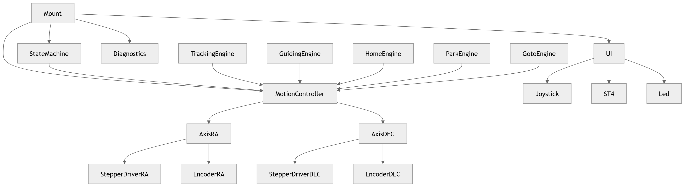

# Domain Model – Asteria EQ

Version : 0.1  
Statut : Draft

## Objectif

Ce document décrit le modèle métier principal du firmware Asteria EQ.

Il définit les concepts centraux du système, leurs responsabilités et leurs relations, indépendamment du matériel utilisé.

Le but est de garantir que le code reflète le domaine de la monture équatoriale, plutôt que les détails d’implémentation Arduino.

---

## Principe général

Asteria EQ est organisé autour d’un objet principal :

### Mount

La monture orchestre le système, mais ne pilote jamais directement le matériel.

Les décisions de mouvement sont centralisées dans un contrôleur dédié :

### MotionController

Les axes exécutent les consignes reçues :

- Axis RA  
- Axis DEC  

Le matériel reste encapsulé derrière des abstractions :

- StepperDriver
- AbsoluteEncoder
- IOExpander

### Vue globale



### Concepts principaux

#### Mount

Mount représente la monture complète.

Responsabilités :

initialiser les modules ;
coordonner les mises à jour ;
gérer la machine d’états globale ;
exposer une API simple au firmware principal.

Mount ne doit pas connaître les broches, les registres, SPI ou I²C.

Exemple d’usage attendu :
```C++
void setup()
{
    mount.begin();
}

void loop()
{
    mount.update();
}
```

#### StateMachine

StateMachine décrit l’état global de la monture.

Elle décide si la monture est en démarrage, test, recherche Home, suivi, guidage, Park ou erreur.

Elle ne calcule pas les mouvements fins.

Elle autorise ou interdit certains comportements selon l’état courant.

#### MotionController

MotionController est l’arbitre central des mouvements.

Il reçoit des demandes de mouvement provenant de plusieurs sources :

- suivi ;  
- guidage ;  
- joystick ;  
- Home ;  
- Park ;   
- GoTo.

Il décide quelles consignes sont prioritaires et produit des commandes cohérentes pour chaque axe.

Responsabilités :

- arbitrer les priorités ;
- éviter les ordres contradictoires ;
- fusionner les corrections compatibles ;
- empêcher les mouvements interdits ;
- transmettre les commandes finales aux axes.

MotionController ne pilote pas directement les moteurs.

#### MotionCommand

MotionCommand représente une consigne de mouvement.

Elle peut exprimer :

- une vitesse cible ;
- une position cible ;
- une accélération ;
- une source ;
- une priorité ;
- une durée éventuelle.

Exemples de sources :

- Tracking
- Guiding
- Joystick
- Home
- Park
- Goto
- Safety

#### Axis

Axis représente un axe physique motorisé.

Il peut s’agir de RA ou DEC.

Responsabilités :

- connaître sa configuration mécanique ;
- maintenir son état théorique ;
- lire sa position réelle ;
- recevoir une consigne ;
- produire des pas moteur ;
- détecter les écarts entre position théorique et position réelle.

Axis ne connaît pas l’astronomie.

Il ne sait pas ce qu’est un suivi sidéral, un GoTo ou un Park.

Il exécute uniquement des consignes.

#### Structure interne d’un axe

Un axe est composé de quatre blocs conceptuels :

#### AxisConfiguration

- AxisState
- AxisTarget
- Hardware interfaces
- AxisConfiguration

Contient les paramètres fixes de l’axe :

- type d’axe ;
- rapport de réduction ;
- nombre de pas moteur par tour ;
- microstepping ;
- sens positif ;
- limites logicielles ;
- vitesse maximale ;
- accélération maximale ;
- résolution encodeur.

Ces valeurs doivent être centralisées dans la configuration.

#### AxisState

Décrit l’état courant de l’axe :

- position théorique ;
- position réelle encodeur ;
- erreur entre théorie et réalité ;
- vitesse actuelle ;
- direction ;
- état Home ;
- état moteur ;
- état de mouvement ;
- état d’erreur éventuel.

#### AxisTarget

Décrit l’intention courante :

- position cible ;
- vitesse cible ;
- accélération cible ;
- mode de mouvement ;
- source de la consigne.

#### Hardware interfaces

Un axe dépend de deux interfaces principales :

- StepperDriver
- AbsoluteEncoder

Ces interfaces doivent permettre de remplacer le matériel sans modifier la logique métier.

#### Drivers et capteurs

##### StepperDriver

Interface abstraite pour un driver moteur pas à pas.

Responsabilités :

- activer ou désactiver le driver ;
- définir la direction ;
- générer une impulsion STEP ;
- signaler un défaut éventuel.

Implémentation actuelle prévue :

- TMC2209

##### AbsoluteEncoder

Interface abstraite pour un encodeur absolu.

Responsabilités :

- initialiser le capteur ;
- lire la position brute ;
- convertir la position en angle ;
- signaler une erreur de lecture.

Implémentation actuelle prévue :

- AS5048A

##### IOExpander

Interface abstraite pour les entrées/sorties déportées.

Responsabilités :

- lire les entrées ST4 ;
- lire les capteurs Home ;
- lire les boutons ;
- piloter la LED d’état ;
- signaler un défaut de communication.

Implémentation actuelle prévue :

- MCP23017

##### **Engines**

Les engines produisent des intentions de mouvement.

Ils ne pilotent jamais directement les axes.

##### **TrackingEngine**

Calcule la vitesse de suivi selon le mode actif :

- sidéral ;
- solaire ;
- lunaire ;
- arrêt.

Produit une commande de vitesse principalement destinée à l’axe RA.


##### **GuidingEngine**


Analyse les entrées ST4.
Produit des corrections temporaires autour du suivi actif.
Ne remplace pas le suivi.

##### **HomeEngine**

Produit les consignes nécessaires pour trouver la position Home.
Il s’appuie sur les capteurs Home et les encodeurs.

##### **ParkEngine**

Produit les consignes nécessaires pour atteindre la position Park.

##### **GotoEngine**

Produit les consignes nécessaires pour atteindre une cible astronomique.

Ce moteur est prévu pour une version future.

##### **Priorités de mouvement**

Les demandes de mouvement ne sont pas toutes équivalentes.

Ordre de priorité proposé :

- Safety
- Park
- Home
- Joystick
- Goto
- Guiding
- Tracking

Interprétation :

- Safety peut tout interrompre.
- Park et Home prennent le contrôle de la monture.
- Joystick permet à l’utilisateur de reprendre la main.
- Goto déplace la monture vers une cible.
- Guiding corrige le suivi.
- Tracking est le mouvement de base.

Cet ordre pourra être révisé après validation pratique.

#### Séparation des responsabilités

##### **Mount ne fait pas**

- de calcul de pas moteur ;
- de lecture SPI directe ;
- de lecture I²C directe ;
- d’arbitrage détaillé des mouvements.

##### **MotionController ne fait pas**

- de lecture capteur directe ;
- de génération STEP directe ;
- de calcul astronomique complexe.

##### **Axis ne fait pas**

- d’arbitrage entre Tracking, GoTo et Park ;
- de lecture joystick ;
- de gestion ST4 ;
- de calcul sidéral.

##### **Engines ne font pas**

- de pilotage moteur direct ;
- d’accès aux broches ;
- de décision matérielle.

#### Exemple de flux : suivi sidéral

```Text
TrackingEngine
    calcule la vitesse sidérale
        ↓
MotionController
    valide et transmet la consigne
        ↓
Axis RA
    convertit la vitesse en impulsions moteur
        ↓
StepperDriver RA
    génère les impulsions STEP
```

#### Exemple de flux : correction ST4

```Text
ST4
    détecte une correction active
        ↓
GuidingEngine
    calcule la correction temporaire
        ↓
MotionController
    fusionne correction + suivi
        ↓
Axis RA / DEC
    exécute la consigne finale
```

#### Exemple de flux : Park

```Text
ParkEngine
    demande une position Park
        ↓
MotionController
    suspend le suivi et donne priorité au Park
        ↓
Axis RA / DEC
    se déplacent vers la position cible
        ↓
StateMachine
    passe à PARKED lorsque la position est atteinte
```

#### Règles d’architecture

- Un module ne doit pas accéder à une responsabilité qui n’est pas la sienne.
- Le matériel est toujours encapsulé derrière une interface.
- Les mouvements sont toujours arbitrés par MotionController.
- Les axes exécutent, mais ne décident pas du contexte.
- Les engines proposent des mouvements, mais ne les imposent pas.
- Toute nouvelle fonctionnalité de mouvement doit s’intégrer via MotionController.

#### Questions ouvertes

- Le joystick doit-il toujours être prioritaire sur le GoTo ?
- Le guidage ST4 doit-il être ignoré pendant un GoTo ?
- Le Park doit-il désactiver les moteurs ou les maintenir alimentés ?
- Les corrections encodeur doivent-elles agir immédiatement ou uniquement être journalisées en V1 ?
- Les axes doivent-ils posséder une machine d’états interne dès la V1 ?
